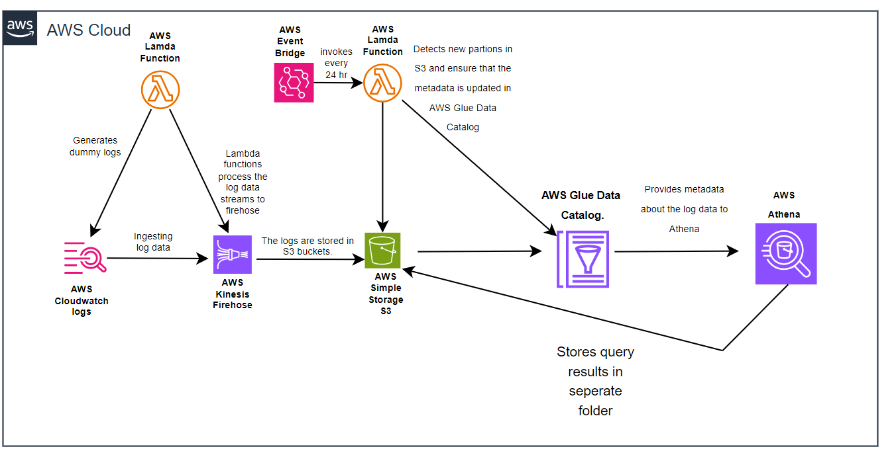

## AWS Serverless Log Management with a Subscription-Based Glue Catalog Update

### Project Summary
This project introduces a **serverless log processing framework** that prioritizes cost-effectiveness and scalability, utilizing AWS services to manage, store, and query logs. The core approach leverages **Kinesis Firehose, EventBridge, and Glue Data Catalog updates** triggered by partition detection, eliminating the need for AWS Glue Crawlers while maintaining efficient log querying with Amazon Athena.

### Core Highlights
- **Optimized Costs**: By using EventBridge and Lambda functions for catalog updates instead of Glue Crawlers, operational costs are significantly reduced.
- **Fully Serverless Solution**: Incorporates AWS Lambda, CloudWatch Logs, Kinesis Firehose, and S3 for a robust, scalable architecture.
- **Efficient Log Queries**: Enables querying of stored logs using Athena with seamless metadata management through the Glue Data Catalog.

### Architecture

### System Components
1. **Lambda for Log Creation**: Responsible for generating logs that are sent to CloudWatch Logs for initial storage.
2. **CloudWatch Subscription**: Configured to send logs directly to Kinesis Firehose through a subscription filter.
3. **Kinesis Firehose Stream**: Compresses and forwards logs from CloudWatch to a designated S3 bucket, where logs are stored based on time-based partitioning.
4. **S3 Log Storage**: Houses the processed log files in partitioned directories for efficient querying.
5. **Scheduled EventBridge Rule**: Triggers a Lambda function every 24 hours to scan S3 for new partitions.
6. **Lambda for Catalog Updates**: Detects new partitions in S3 and updates the Glue Data Catalog with the corresponding metadata.
7. **Glue Data Catalog**: Provides metadata storage, which Athena uses to query the logs stored in S3.
8. **Athena**: SQL-like queries are run against logs using metadata from the Glue Data Catalog, with results stored in another S3 bucket.

### Workflow Overview
1. **Log Generation**: A Lambda function generates and sends logs to CloudWatch.
2. **Log Transfer and Storage**: CloudWatch forwards the logs to Kinesis Firehose via a subscription filter, which processes and stores them in S3.
3. **Daily Partition Detection**: EventBridge triggers a Lambda function every 24 hours to check for new S3 partitions.
4. **Glue Catalog Update**: Detected new partitions are added to the Glue Data Catalog, ensuring that metadata is always up to date.
5. **Log Queries**: Logs stored in S3 can be queried with Athena, using the Glue Data Catalog for reference.

### Cost-Effectiveness and Scalability
This design removes the need for Glue Crawlers, substituting them with **Lambda functions** triggered by EventBridge, drastically lowering the costs associated with metadata management. This method ensures **scalability** by adapting to any log volume without incurring the high costs of continuous Glue Crawler execution.

### AWS Services Utilized
- **AWS Lambda**: Handles log generation and Glue Catalog updates.
- **CloudWatch Logs**: Stores logs before streaming them via Kinesis Firehose.
- **Kinesis Firehose**: Streams logs from CloudWatch to S3, ensuring efficient storage.
- **Amazon S3**: Stores the logs in an organized, partitioned structure.
- **EventBridge**: Triggers periodic Glue Catalog updates.
- **Glue Data Catalog**: Stores metadata for logs in S3.
- **Amazon Athena**: Enables flexible SQL-like querying of the logs.

### Conclusion
By using a **subscription-based log streaming** method and EventBridge-triggered Lambda functions for Glue Catalog updates, this project offers a cost-effective, scalable alternative to Glue Crawlers. The solution optimizes performance for large-scale log processing while significantly reducing operational costs.

---
